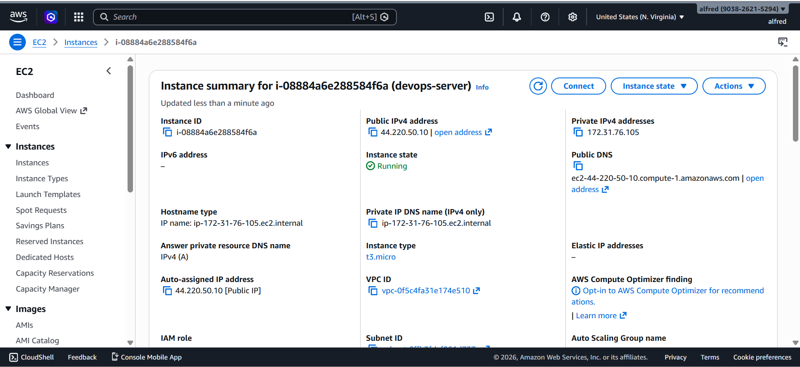
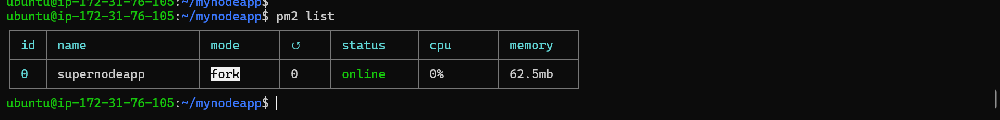
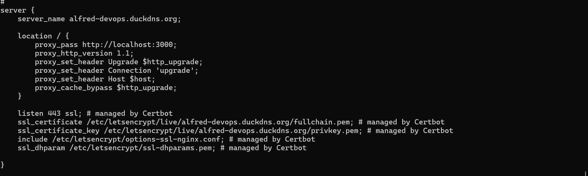
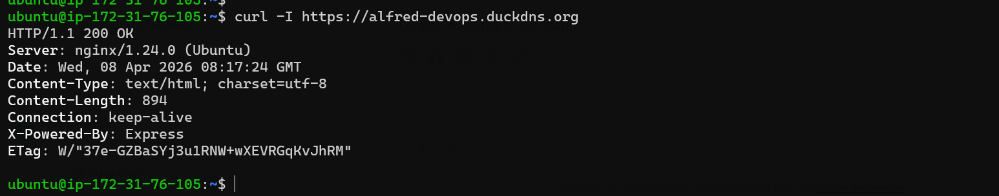
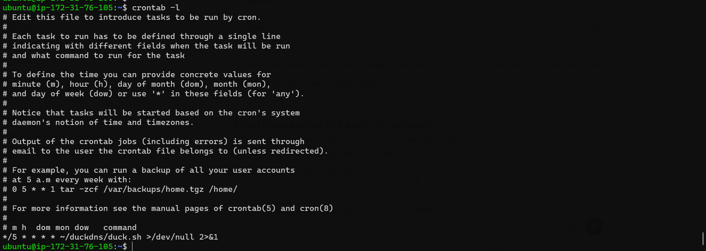
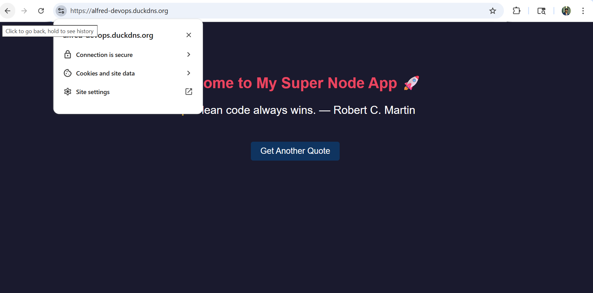

# 🚀 Node.js Application Deployment with Nginx Reverse Proxy on AWS EC2

## 💼 Freelance Service Offering

I provide professional backend deployment and server configuration services.

### ✅ Services I Offer:

* 🌐 Node.js application deployment on AWS EC2
* ⚙️ Nginx reverse proxy configuration
* 🔗 Domain setup and integration
* 🔒 HTTPS setup using Let's Encrypt SSL
* 🚀 Production-ready server configuration

📩 **Available for freelance work**

---

## 📌 Project Overview

This project demonstrates deploying a Node.js application on an AWS EC2 instance and configuring Nginx as a reverse proxy to serve the application securely over standard HTTP/HTTPS ports.

---

## 🛠️ Technologies Used

* AWS EC2
* Ubuntu Linux
* Node.js
* Nginx
* PM2 (Process Manager)
* SSH

---

## 🏗️ Architecture

```
User → Nginx (Port 80/443) → Node.js App (Port 3000)
```

### 🔍 Explanation:

* Nginx handles incoming client requests
* Forwards traffic to the Node.js application
* Node.js processes the request and returns the response

---

## 🚀 Steps Performed

1. Created EC2 instance on AWS
2. Connected to server using SSH
3. Installed Node.js and npm
4. Developed and ran Node.js application
5. Installed and configured Nginx
6. Set up reverse proxy (port 80 → 3000)
7. Managed application using PM2
8. Verified application without exposing internal port

---

## 🌐 Live Demo

⚠️ The EC2 instance has been stopped to avoid AWS charges.

The application was successfully deployed and tested in a live environment.

---

## 📸 Screenshots

### ☁️ AWS EC2 Instance Running



---

### ⚙️ PM2 Process Manager



---

### 🔧 Nginx Configuration



---

### 📡 Curl Test (Application Response)



---

### 🔄 DuckDNS Auto Update (Crontab)



---

### 🌍 Final Output (Clean URL via Nginx)



---

## 🔐 Security Configuration

* Opened ports:

  * 22 (SSH)
  * 80 (HTTP)
  * 443 (HTTPS)

* Configured Nginx as a reverse proxy to hide internal application ports

* Managed access securely using EC2 Security Groups

---

## ⚙️ Process Management

Used PM2 to:

* Keep the Node.js application running continuously
* Restart automatically on failure
* Run the application in the background

---

## 🎯 What This Project Demonstrates

* Real-world backend deployment on cloud
* Reverse proxy configuration using Nginx
* Secure and clean URL routing
* Production-ready Node.js setup

---

## 💰 Cost Optimization

* Used AWS Free Tier resources
* Stopped instance after testing
* Avoided unnecessary cloud charges

---

## 🚀 Future Improvements

* Add custom domain and HTTPS
* Dockerize the application 🐳
* Implement CI/CD pipeline
* Deploy using Load Balancer for scalability

---

## 👨‍💻 Author

**Alfred Johnson**
🔗 https://github.com/Alfred-Johnson

---

## 📞 Contact

📧 alfredjohnson1823@gmail.com

💼 Open to freelance opportunities

---

## 📌 Conclusion

This project showcases a complete real-world deployment of a Node.js application using Nginx reverse proxy on AWS EC2, highlighting practical DevOps and cloud engineering skills.

---
